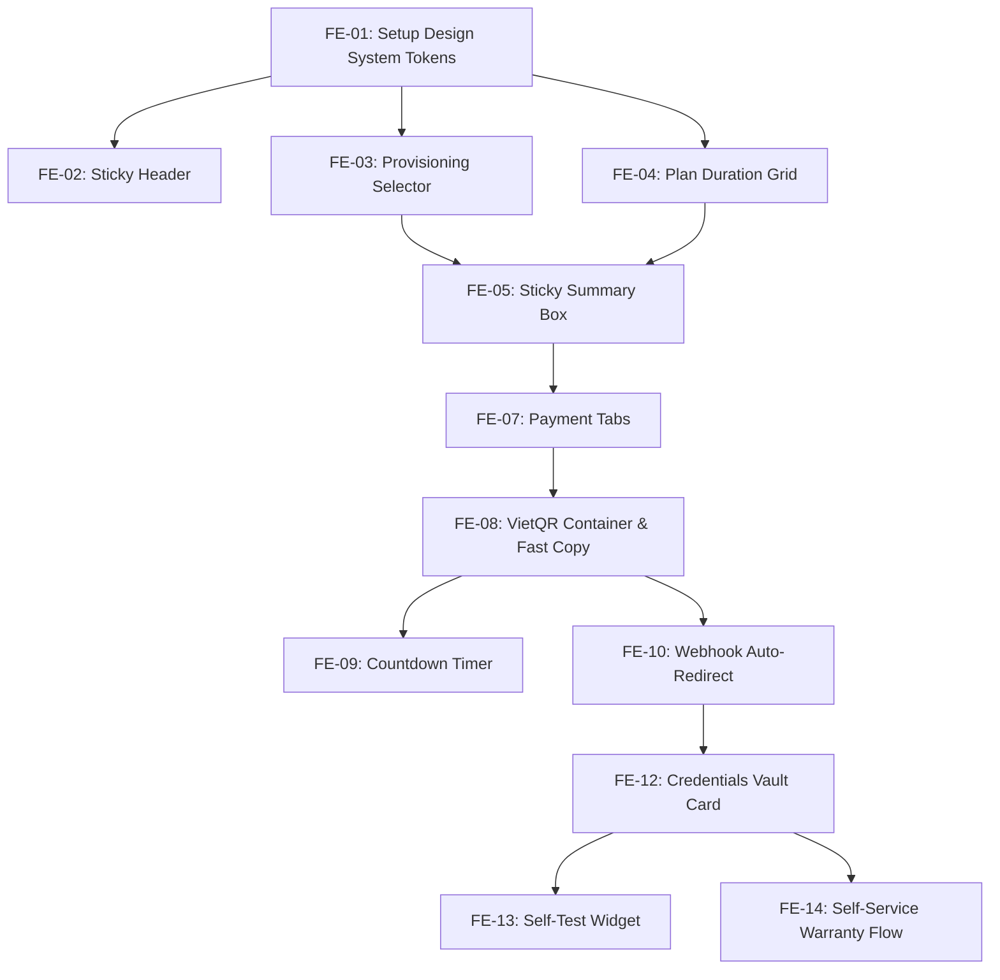

# BẢNG PHÂN RÃ TÁC VỤ FRONTEND CHO JIRA / TRELLO (SPRINT BACKLOG)
## DỰ ÁN: NỀN TẢNG THƯƠNG MẠI ĐIỆN TỬ TÀI KHOẢN AI PRO CHO DEVELOPERS
*Mã Sprint: `SPRINT-01-AIPRO` | Chu kỳ: 2 tuần (10 working days)*  
*Vai trò: Senior Project Manager & Certified Scrum Master (PSM II / PMP)*  
*Căn cứ kỹ thuật: `UI_UX_Specification_AI_PRO.md`, `DesignOps_Asset_Checklist_AI_PRO.md` và thư mục `/assets`*

---

## TỔNG QUAN EPIC & STORY POINTS (SPRINT PLANNING)

| Epic ID | Tên Epic | Số lượng Task | Tổng Story Points (SP) |
| :--- | :--- | :--- | :--- |
| **EPIC-01** | **Core Foundation & Global Design System** | 3 Tasks | 8 SP |
| **EPIC-02** | **Trang Chi Tiết & Cấu Hình Gói Dịch Vụ (Product Configurator)** | 4 Tasks | 13 SP |
| **EPIC-03** | **Trang Thanh Toán Siêu Tốc (Ultra-Fast Guest Checkout)** | 5 Tasks | 16 SP |
| **EPIC-04** | **Trang Bàn Giao Bản Quyền & Tự Phục Vụ Bảo Hành (Fulfillment & Vault)** | 3 Tasks | 10 SP |
| **TỔNG CỘNG** | **4 Epics** | **15 Tasks** | **47 Story Points** |

---

## CHI TIẾT TỪNG TÁC VỤ (JIRA/TRELLO USER STORIES & TASKS)

---

### EPIC-01: CORE FOUNDATION & GLOBAL DESIGN SYSTEM

#### 📌 Task 1: `[FE-01][Setup] Cấu hình CSS Design System Tokens & Base Theme Dark Mode`
- **Mã Jira**: `AIPRO-101`
- **Story Points**: 3 SP | **Priority**: High (P1)
- **Mô tả (Description)**:
  - Khởi tạo toàn bộ CSS Custom Properties (Variables) trong tệp `globals.css` / `index.css` theo đúng bảng Design Tokens tại Mục 1.2 trong tài liệu UI/UX Specs.
  - Cấu hình màu chủ đạo: `--bg-canvas` (`#08090C`), `--bg-surface` (`#101318`), `--primary-blue` (`#0066FF`), `--accent-cyan` (`#00F0FF`).
  - Tích hợp 2 bộ font từ Google Fonts: `Inter` (UI/Body) và `JetBrains Mono` (Code/Price/Token).
  - Cấu hình CSS Reset và Spacing Grid 8-point (`8px`, `16px`, `24px`, `32px`...).
- **Tiêu chí nghiệm thu (Acceptance Criteria - DoD)**:
  - [ ] Kiểm tra trên DevTools: Toàn bộ biến CSS được load đầy đủ ở `:root`.
  - [ ] Nền trang mặc định ăn đúng mã màu `#08090C`, không bị nhấp nháy sáng (No white flash / FOUC).
  - [ ] Font `Inter` áp dụng cho thẻ `
`, `<h1>`..`<h6>`; Font `JetBrains Mono` áp dụng cho thẻ `<code>`, `.price`, `.key`.
  - [ ] Đạt chuẩn tương phản màu chữ/nền tối thiểu WCAG AA (>= 4.5:1).

---

#### 📌 Task 2: `[FE-02][Component] Xây dựng Header Navigation dính (Sticky Header)`
- **Mã Jira**: `AIPRO-102`
- **Story Points**: 2 SP | **Priority**: High (P1)
- **Mô tả (Description)**:
  - Code component `StickyHeader`: chiều cao chuẩn `64px`, `backdrop-filter: blur(12px)`, nền `rgba(8, 9, 12, 0.85)`.
  - Nhúng logo chính từ thư mục `/assets/logos/logo_aipro_main_dark.svg`.
  - Hiển thị menu links dạng Ghost links: `AI Coding`, `Claude & GPT`, `Team / API`.
  - Nút chuyển đổi tiền tệ `VND (₫)` / `USD ($)` và nút `Tra cứu đơn hàng` có icon kính lúp.
- **Tiêu chí nghiệm thu (Acceptance Criteria - DoD)**:
  - [ ] Header luôn cố định trên đỉnh khi cuộn trang (`position: sticky; top: 0; z-index: 50`).
  - [ ] Hover vào menu links: Chữ đổi màu sang `--text-primary` kèm hiệu ứng gạch chân trượt ngang `150ms`.
  - [ ] Bấm chuyển `VND`/`USD`: State tiền tệ toàn trang thay đổi lập tức và lưu vào `localStorage`.
  - [ ] Trên mobile (`< 768px`): Ẩn các menu links phụ, chỉ giữ Logo và nút Tra cứu đơn để tối giản giao diện.

---

### EPIC-02: TRANG CHI TIẾT & CẤU HÌNH GÓI SẢN PHẨM (PRODUCT CONFIGURATOR - TRANG 2)

#### 📌 Task 3: `[FE-03][Component] Xây dựng Bộ chọn Loại Bàn Giao (Provisioning Type Selector)`
- **Mã Jira**: `AIPRO-103`
- **Story Points**: 3 SP | **Priority**: High (P1)
- **Mô tả (Description)**:
  - Code component `ProvisioningSelector` dạng 2 Thẻ Radio song song:
    - Thẻ A: *"Nâng cấp trực tiếp trên Email cá nhân"* (Không mất dữ liệu, giữ nguyên chat history cũ).
    - Thẻ B: *"Tài khoản tạo sẵn (Cấp tức thì trong 10 giây)"* kèm badge `⚡ Sẵn sàng`.
  - Hiển thị logo chính hãng tương ứng (lấy từ `/assets/logos/logo_brand_cursor.svg`, `logo_brand_anthropic_claude.svg`...).
- **Tiêu chí nghiệm thu (Acceptance Criteria - DoD)**:
  - [ ] Khi click chọn Thẻ A: Hiển thị hiệu ứng viền xanh `--primary-blue`, đồng thời trượt mở một ô input: *"Nhập email cá nhân cần nâng cấp"* (Slide-down animation 200ms).
  - [ ] Khi click chọn Thẻ B: Ô input email nâng cấp tự động thu gọn lại (Slide-up).
  - [ ] Thẻ được chọn phải có icon radio checked rõ ràng và viền glow nhẹ `box-shadow: 0 0 12px rgba(0,102,255,0.2)`.
  - [ ] Nếu cấu hình backend trả về `out_of_stock_invite = true`: Thẻ A chuyển sang disabled (xám mờ), không click được và hiện badge `Tạm hết slot mời hôm nay`.

---

#### 📌 Task 4: `[FE-04][Component] Xây dựng Lưới chọn Kỳ Hạn (Plan Duration Grid)`
- **Mã Jira**: `AIPRO-104`
- **Story Points**: 3 SP | **Priority**: High (P1)
- **Mô tả (Description)**:
  - Code lưới 4 nút chọn kỳ hạn: `1 Tháng`, `3 Tháng (Tiết kiệm 15%)`, `6 Tháng`, `12 Tháng (Tặng 1 tháng)`.
  - Sử dụng thẻ CSS Grid 4 cột trên Desktop, 2x2 trên Mobile.
  - Trên mỗi nút hiển thị: Tên kỳ hạn, đơn giá tương đương theo tháng (font Mono) và Badge chiết khấu (nếu có).
- **Tiêu chí nghiệm thu (Acceptance Criteria - DoD)**:
  - [ ] Trạng thái Active: Viền đổi sang `--primary-blue`, nền `--bg-elevated`, xuất hiện dấu checkmark nhỏ góc phải.
  - [ ] Bấm phím mũi tên bàn phím (ArrowLeft/ArrowRight) cho phép di chuyển chọn giữa các kỳ hạn (Chuẩn A11y Accessibility).
  - [ ] Tương thích hoàn hảo: Chiều cao tối thiểu của nút trên mobile đạt `48px` để ngón cái bấm chuẩn xác.

---

#### 📌 Task 5: `[FE-05][Component] Hộp Tóm Tắt & Tính Giá Tức Thì Dính Theo Màn Hình (Sticky Summary Box)`
- **Mã Jira**: `AIPRO-105`
- **Story Points**: 5 SP | **Priority**: Critical (P0)
- **Mô tả (Description)**:
  - Code component `StickySummaryBox` ở cột phải màn hình chi tiết sản phẩm.
  - Cột này dính theo màn hình khi người dùng cuộn xem thông số kỹ thuật bên trái (`position: sticky; top: 88px`).
  - Hiển thị: Tên gói, loại tài khoản đã chọn, giá gốc (gạch ngang), ưu đãi dev (xanh lá), thuế/phí (`+ 0 ₫`).
  - Số tiền tổng: Font `JetBrains Mono` 32px Bold.
  - Input `Email nhận hàng` (Guest input) kèm icon phong bì.
  - Nút Primary CTA: `⚡ Thanh Toán Ngay (30s)`.
- **Tiêu chí nghiệm thu (Acceptance Criteria - DoD)**:
  - [ ] Khi đổi kỳ hạn hoặc loại tài khoản: Tổng số tiền cập nhật tức thì với hiệu ứng nhảy số mượt mà (Number rolling / Odometer 200ms).
  - [ ] Ô nhập Email:
    - Validate real-time theo regex email chuẩn RFC 5322.
    - Nhập sai định dạng: Viền đỏ + thông báo lỗi bên dưới.
    - Nhập đúng định dạng: Viền xanh lá + icon checkmark xuất hiện.
  - [ ] Nút CTA `Thanh Toán Ngay`: Chỉ bấm được khi đã nhập email hợp lệ. Khi click: Điều hướng sang Trang 3 (`/checkout`) và truyền state gói hàng qua URL params / Global State.

---

#### 📌 Task 6: `[FE-06][Component] Bảng Thông Số Kỹ Thuật & Widget Cam Kết SLA (Dev Specs & SLA)`
- **Mã Jira**: `AIPRO-106`
- **Story Points**: 2 SP | **Priority**: Medium (P2)
- **Mô tả (Description)**:
  - Code danh sách thông số kỹ thuật dành cho dev: Model AI hỗ trợ (Claude 3.7 Sonnet, GPT-4.5), Hạn mức request nhanh/tháng, Giới hạn cửa sổ ngữ cảnh (Context Window 200K), Số thiết bị đồng bộ.
  - Code Khung cam kết bảo hành (SLA): Hoàn tiền 100%, Bảo hành 1-đổi-1 tự động trong 90 ngày, Không lưu trữ mật khẩu người dùng. Sử dụng các icon từ thư mục `/assets/icons/ic_shield_check.svg`, `ic_check_circle.svg`.
- **Tiêu chí nghiệm thu (Acceptance Criteria - DoD)**:
  - [ ] Icon hiển thị đúng mã vector, không bị răng cưa.
  - [ ] Accordion cho phần chính sách bảo hành: Bấm mở ra/đóng lại mượt mà với animation `200ms ease`.

---

### EPIC-03: TRANG THANH TOÁN SIÊU TỐC (ULTRA-FAST GUEST CHECKOUT - TRANG 3)

#### 📌 Task 7: `[FE-07][Component] Tab Chuyển Đổi Kênh Thanh Toán (Multi-channel Payment Tabs)`
- **Mã Jira**: `AIPRO-107`
- **Story Points**: 3 SP | **Priority**: High (P1)
- **Mô tả (Description)**:
  - Code bộ 3 Tabs thanh toán: `VietQR Tự Động` (Mặc định), `Thẻ Quốc Tế (Stripe)`, `Crypto USDT (Web3)`.
  - Nhúng logo chính thức từ thư mục `/assets/logos/`: `logo_pay_vietqr.svg`, `logo_pay_stripe.svg`, `logo_pay_usdt_crypto.svg`.
- **Tiêu chí nghiệm thu (Acceptance Criteria - DoD)**:
  - [ ] Tab được chọn có viền sáng `--primary-blue`, chuyển tab lập tức mà không làm giật layout.
  - [ ] Lưu trạng thái tab thanh toán yêu thích vào `localStorage`.

---

#### 📌 Task 8: `[FE-08][Component] Khung Quét Mã VietQR Động & Nút Sao Chép Nhanh (Dynamic VietQR Widget)`
- **Mã Jira**: `AIPRO-108`
- **Story Points**: 5 SP | **Priority**: Critical (P0)
- **Mô tả (Description)**:
  - Code component `VietQRContainer`: Hiển thị ảnh QR kích thước chuẩn `220x220px` trên nền trắng bo góc `8px`.
  - Hiệu ứng Radar Pulse xanh dương quét nhẹ xung quanh khung QR.
  - Hiển thị 3 hàng thông tin chuyển khoản: Ngân hàng thụ hưởng, Số tài khoản, Số tiền chính xác, Nội dung chuyển khoản chứa mã đơn hàng duy nhất (Ví dụ: `AIPRO84920`).
  - Tích hợp 3 nút `Sao chép` cạnh mỗi hàng thông tin.
- **Tiêu chí nghiệm thu (Acceptance Criteria - DoD)**:
  - [ ] Bấm nút `Sao chép`:
    - Gọi Web Clipboard API `navigator.clipboard.writeText()`.
    - Dữ liệu copy đúng 100%, không dính khoảng trắng thừa. Riêng số tiền chỉ copy số nguyên (ví dụ: `749000`).
    - Nút đổi icon sang `ic_copy_success.svg` kèm chữ *"✓ Đã sao chép"* trong 2 giây rồi tự hoàn nguyên.
  - [ ] Khi đang tải mã QR: Hiển thị khung Skeleton Placeholder từ `/assets/images/img_qr_placeholder.svg`.

---

#### 📌 Task 9: `[FE-09][Logic] Đồng Hồ Đếm Ngược Giữ Slot & Quản Lý Phiên (Countdown Timer Widget)`
- **Mã Jira**: `AIPRO-109`
- **Story Points**: 3 SP | **Priority**: High (P1)
- **Mô tả (Description)**:
  - Code bộ đếm lùi thời gian 10 phút (`09:59` -> `00:00`), font `JetBrains Mono` 18px Bold.
  - Thanh Progress Bar bên dưới đồng hồ co lại dần theo thời gian thực.
- **Tiêu chí nghiệm thu (Acceptance Criteria - DoD)**:
  - [ ] Chữ số đếm ngược không bị gián đoạn hay nhảy sai nhịp khi người dùng đổi tab trình duyệt (Sử dụng Web Worker hoặc tính theo mốc `Date.now()`).
  - [ ] Khi đếm về `00:00`:
    - Khung QR bị làm mờ bằng lớp phủ `backdrop-filter: blur(4px)`.
    - Hiện nút bấm nổi bật: `🔄 Làm mới mã thanh toán`.
    - Vô hiệu hóa (disable) các nút sao chép thông tin chuyển khoản cũ.

---

#### 📌 Task 10: `[FE-10][Logic] Xử Lý Tự Động Chuyển Hướng Sau Thanh Toán (Webhook Auto-Redirect)`
- **Mã Jira**: `AIPRO-110`
- **Story Points**: 3 SP | **Priority**: Critical (P0)
- **Mô tả (Description)**:
  - Tích hợp cơ chế lắng nghe trạng thái thanh toán từ Backend (WebSocket hoặc Polling nhẹ mỗi 2 giây).
  - Khi Backend xác nhận đã nhận tiền thành công từ ngân hàng:
    - Phát âm thanh chuông nhẹ (Success chime).
    - Màn hình hiện dấu tích xanh lớn `✓ ĐÃ NHẬN THANH TOÁN`.
    - Tự động chuyển hướng (Auto-redirect) sang Trang 4 (`/order/success/:orderId`) sau đúng `1.2 giây`.
- **Tiêu chí nghiệm thu (Acceptance Criteria - DoD)**:
  - [ ] Người dùng không cần bấm bất kỳ nút nào, hệ thống tự động hoàn tất 100%.
  - [ ] Xử lý kịch bản khách chuyển thiếu tiền: Hiển thị Modal thông báo số tiền còn thiếu và QR cập nhật đúng số tiền thiếu.

---

#### 📌 Task 11: `[FE-11][Mobile] Thanh Hành Động Cố Định Chân Trang (Sticky Bottom CTA Bar)`
- **Mã Jira**: `AIPRO-111`
- **Story Points**: 2 SP | **Priority**: High (P1)
- **Mô tả (Description)**:
  - Trên màn hình di động (`width < 768px`), khi cuộn vượt quá màn hình đầu tiên, kích hoạt thanh Bar cố định sát đáy màn hình (Thumb Zone).
  - Bên trái: Tên gói vắn tắt + Giá tiền. Bên phải: Nút `⚡ Mua ngay` (Chiều cao `48px`).
- **Tiêu chí nghiệm thu (Acceptance Criteria - DoD)**:
  - [ ] Thanh Bar trượt lên mượt mà (Slide-up 200ms) khi người dùng cuộn xuống.
  - [ ] Tap target của nút đạt tối thiểu `44x44px`, ngón cái dễ dàng chạm tới mà không cần rướn tay.

---

### EPIC-04: TRANG BÀN GIAO & TỰ PHỤC VỤ BẢO HÀNH (FULFILLMENT & VAULT - TRANG 4 & 5)

#### 📌 Task 12: `[FE-12][Component] Khung Bảo Mật Lưu Trữ Tài Khoản (Credentials Vault Card)`
- **Mã Jira**: `AIPRO-112`
- **Story Points**: 4 SP | **Priority**: Critical (P0)
- **Mô tả (Description)**:
  - Code khung hiển thị tài khoản vừa bàn giao: Email đăng nhập, Mật khẩu / Access Token, Mã 2FA Secret.
  - Nút con mắt ẩn/hiện mật khẩu (Toggle Show/Hide password).
  - Nút `Sao chép thông tin` cho từng dòng và nút `Sao chép toàn bộ định dạng Markdown`.
  - Nút `💾 Tải file credentials (.json / .env)` để lưu vào Password Manager.
- **Tiêu chí nghiệm thu (Acceptance Criteria - DoD)**:
  - [ ] Mặc định mật khẩu được che bằng dấu chấm `••••••••••••`. Click con mắt đổi sang text rõ.
  - [ ] Bấm tải file: Trình duyệt tải ngay file `aipro-credentials-[orderId].json` chứa cấu hình chuẩn.

---

#### 📌 Task 13: `[FE-13][Component] Widget Kiểm Tra Trạng Thái Tài Khoản Tự Động (Self-Test Health Check)`
- **Mã Jira**: `AIPRO-113`
- **Story Points**: 2 SP | **Priority**: Medium (P2)
- **Mô tả (Description)**:
  - Code nút `🟢 Kiểm tra tình trạng tài khoản ngay (Verify Status)`.
  - Khi click: Hiển thị spinner xoay tròn trong 1-2 giây gọi API backend test session.
  - Kết quả trả về: Badge xanh lá `🟢 Tài khoản Active 100% - Đã sẵn sàng`.
- **Tiêu chí nghiệm thu (Acceptance Criteria - DoD)**:
  - [ ] Hiển thị thông báo trạng thái rõ ràng, giúp xóa bỏ tâm lý hoài nghi của khách hàng sau khi mua.

---

#### 📌 Task 14: `[FE-14][Component] Quy Trình Tự Đổi Mới Tài Khoản 1-Click (Self-Service Replacement Flow)`
- **Mã Jira**: `AIPRO-114`
- **Story Points**: 4 SP | **Priority**: High (P1)
- **Mô tả (Description)**:
  - Code giao diện bảo hành tự động tại Trang 5: Form chọn lý do sự cố (Out gói Pro, Sai mật khẩu, Bị giới hạn thiết bị).
  - Nút bấm `⚡ Kích hoạt đổi mới tài khoản tự động trong 60s`.
  - Modal xác nhận: *"Hệ thống sẽ thu hồi tài khoản cũ và trích xuất tài khoản mới ngay lập tức"*.
  - Thanh tiến trình động 4 bước: *Kiểm tra -> Xác thực -> Cấp mới -> Hoàn tất*.
- **Tiêu chí nghiệm thu (Acceptance Criteria - DoD)**:
  - [ ] Khi hoàn tất: Cập nhật ngay thông tin tài khoản mới lên màn hình mà không cần reload trang.
  - [ ] Khống chế hạn mức: Nếu đổi quá 2 lần/24h, vô hiệu hóa nút và hiển thị link chat Telegram kỹ thuật viên.

---

## BẢNG TỔNG HỢP PHÂN CÔNG & MỐI QUAN HỆ PHỤ THUỘC (DEPENDENCY MAP)

